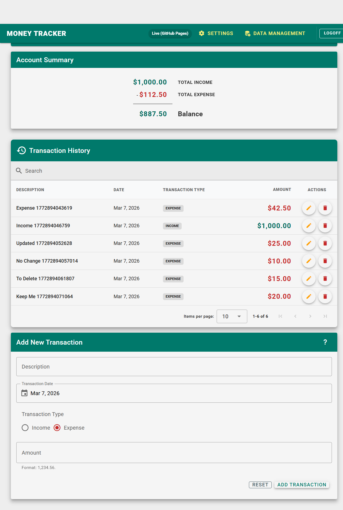

# MoneyTracker

> A full-stack personal finance tracker with multi-locale support, built as a progressive enhancement of a course project into a production-grade application.

**[Live Demo](https://rhinocan.github.io/MoneyTracker/)**

---


(https://rhinocan.github.io/docs/MoneyTracker.png)

---

## Overview

MoneyTracker lets users record income and expense transactions, view a live account summary, and manage their data — all behind a secure authenticated session. The project began as a follow-along with a Brad Traversy course and was subsequently rebuilt from the ground up with a production mindset: TypeScript throughout, a Vuetify component library, Pinia state management, Supabase for auth and persistence, full i18n support across 16 locales, and a comprehensive automated test suite.

The goal was not just a working app but a demonstrably well-engineered one — the kind where the code is as considered as the features.

---

## Features

- **Authentication** — register, log in, and log out via Supabase Auth; each user's data is fully isolated
- **Transaction management** — add, edit, and delete income and expense transactions with date tracking
- **Account summary** — live-calculated total income, total expenses, and net balance
- **Multi-locale support** — 16 locales with locale-aware currency formatting, decimal separators, and date display; includes RTL support for Arabic (ar-SA)
- **Data management** — export transactions to CSV, restore settings to defaults, or wipe all data
- **Keyboard shortcuts** — power-user shortcuts for form submission and navigation
- **Persistent settings** — locale and display preferences saved per user to Supabase
- **Responsive layout** — works on desktop and mobile

---

## Tech Stack

| Layer | Technology |
|---|---|
| Framework | Vue 3 (Composition API) |
| UI Library | Vuetify 3 |
| State Management | Pinia |
| Language | TypeScript |
| Backend / Auth / DB | Supabase (PostgreSQL + Row Level Security) |
| Internationalisation | vue-i18n (16 locales) |
| Routing | Vue Router 4 |
| Build Tool | Vite |
| Unit Testing | Vitest |
| E2E Testing | Playwright |
| Error Logging | Sentry |
| Analytics | PostHog |
| Deployment | GitHub Pages via deploy script |

---

## Local Development Setup

### Prerequisites

- Node.js 18+
- A [Supabase](https://supabase.com) project with the transactions and settings tables provisioned

### Steps

```bash
# 1. Clone the repository
git clone https://github.com/rhinocan/MoneyTracker.git
cd MoneyTracker

# 2. Install dependencies
npm install

# 3. Configure environment variables
cp .env.example .env
# Edit .env and fill in your Supabase URL and anon key

# 4. Start the development server
npm run dev
```

The app will be available at `http://localhost:5173/MoneyTracker/`.

### Environment Variables

| Variable | Description |
|---|---|
| `VITE_SUPABASE_URL` | Your Supabase project URL |
| `VITE_SUPABASE_ANON_KEY` | Your Supabase anonymous (public) key |

---

## Running Tests

### Unit Tests

```bash
# Run all unit tests
npm run test

# Run with coverage report
npm run test:coverage
```

Current coverage: **99.28% statement**, **95.62% branch** across 559 tests in 31 files.

### E2E Tests (Playwright)

```bash
# Run all E2E tests (Chromium)
npx playwright test --project=chromium

# Run a single spec file
npx playwright test --project=chromium tests/e2e/transactions.spec.ts

# View the HTML report from the last run
npx playwright show-report
```

E2E tests require the dev server to be running and a valid test account (`foo@foobar.com` / `foobar`) to exist in your Supabase project.

Current E2E status: **31/31 passing** across 4 spec files (auth, transactions, locales, dataManagement).

#### Running against the live site

```bash
BASE_URL=https://rhinocan.github.io/MoneyTracker npx playwright test --project=chromium
```

---

## Deployment

The app is deployed to GitHub Pages from the `gh-pages` branch.

```bash
# From the main branch
./deploy.sh
```

The script builds the app and pushes the `dist/` folder to `gh-pages`. Build and deploy status is visible in the repository's Actions tab. Occasional GitHub 500/502 errors during deploy are transient — re-running the script resolves them.

---

## Project Evolution

This project started as a follow-along with a Brad Traversy course and was incrementally upgraded into its current form. Notable additions beyond the original course material:

- Replaced `localStorage` with Supabase for persistent, per-user data
- Replaced plain JavaScript with TypeScript throughout
- Replaced hand-rolled components with Vuetify 3
- Replaced prop drilling with Pinia stores
- Added Vue Router with authenticated route guards
- Added vue-i18n with 16 locales and RTL support
- Added a full unit test suite (Vitest) with >99% statement coverage
- Added a full E2E test suite (Playwright) with 31 passing tests
- Added Sentry for error logging and PostHog for analytics
- Added CSV export and a data management screen

---

## Known Limitations

- **No category tagging** — transactions cannot be filtered or grouped by category
- **No recurring transactions** — each transaction must be entered manually

---

## Future Enhancements

- Playwright auth state caching to speed up the E2E suite (currently each test authenticates fresh against Supabase)
- Category tagging and filtering for transactions
- Charts and spending trend visualisation
- Recurring transaction support
- Dark mode
- **Tax-inclusive vs. tax-exclusive amounts** — in countries like Canada where sales tax (GST/HST/PST) is added at the till rather than included in the sticker price, it would be useful to record both the pre-tax amount and the tax paid separately, giving a clearer picture of actual spending
- Additional locales and currencies as demand warrants

---

## Acknowledgements

Built with significant assistance from [Claude](https://claude.ai) (Anthropic), [ChatGPT](https://chat.openai.com) (OpenAI), and [Gemini](https://gemini.google.com) (Google) — each contributed at various points throughout development. Thanks also to Brad Traversy for the original course project that served as the starting point.
